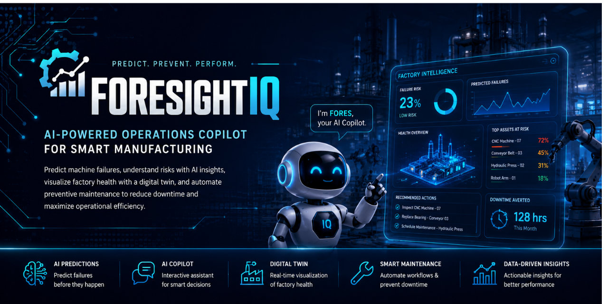

  

# 🏭 ForesightIQ

  

## 🚀 Overview

ForesightIQ is an AI-powered Operations Copilot for smart manufacturing that predicts machine failures before they occur, explains potential risks using AI, visualizes factory health through a digital twin, and automates preventive maintenance workflows to minimize downtime and improve operational efficiency.

## ✨ Features

- 🤖 AI Operations Copilot
- 📈 Failure Prediction
- 🏭 Digital Twin Dashboard
- 🔥 Factory Heatmap
- 🛠 Smart Maintenance Planner
- 📊 Executive Reports
- 📅 End-of-Day Summary
- ⚡ AI Confidence Score

## 🛠️ Tech Stack

| Technology | Purpose |
|------------|---------|
| ⚛️ React | Frontend UI |
| 🔷 TypeScript | Type-safe Development |
| ⚡ Vite | Fast Build Tool |
| 🎨 CSS3 | Styling & Responsive Design |
| 🤖 Gemini AI | AI-powered Insights & Copilot |
| 📊 Recharts | Interactive Data Visualization |
| 🛠 Git & GitHub | Version Control |

## 🚀 Future Scope

- IoT Sensor Integration
- Real-time Predictive Analytics
- Mobile Monitoring App
- ERP Integration
- AI-Based Root Cause Analysis